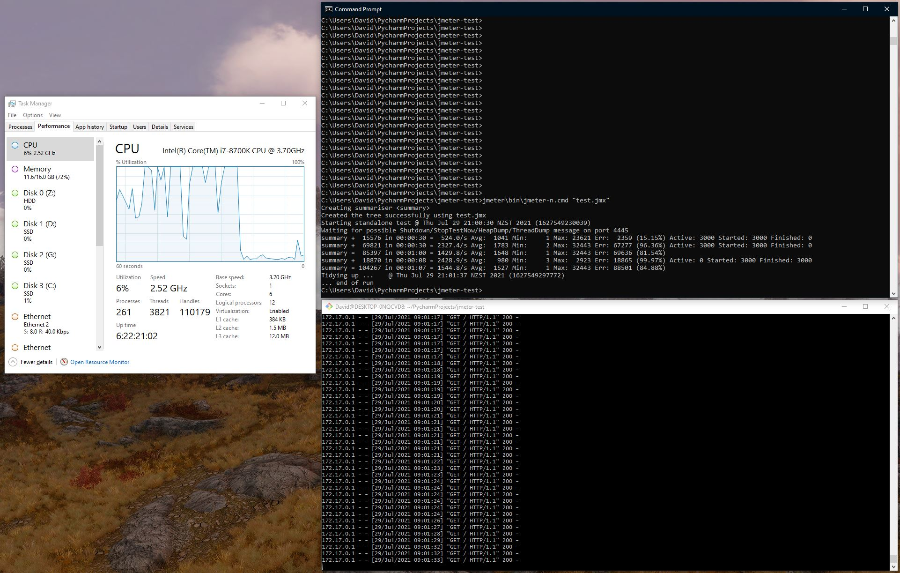

# Jmeter testing

## Overview

Small demo repository to exhibit load testing with Apache Jmeter.

This takes a default python Flask app and hammers it with 3000 users (threads), each infinitely calling
the root path on `localhost`

## Usage

Install Jmeter from here

https://jmeter.apache.org/download_jmeter.cgi

And extract the zip to the jmeter folder (Or not, I can't tell you what to do)

Build and run the app with

```bash
docker build . -t jmeter-testing
docker run --rm -p 5000:5000 jmeter-testing
```

### Setting up a plan

Open `jmeter\bin\jmeter.cmd` to enter the GUI for setting up a test plan.

Save the plan to disk, to be ran via the non gui version.

`test.jmx` is already setup as described in the overview

### Running the plan

Windows

For Windows, there are also some other scripts which you can drag-and-drop a JMX file onto:

    jmeter-n.cmd - runs the file as a non-GUI test
    jmeter-n-r.cmd - runs the file as a non-GUI remote (client-server) test
    jmeter-t.cmd - loads the file ready to run it as a GUI test

Which translates to the following.

```cmd
jmeter\bin\jmeter-n.cmd "test.jmx"
```

Your results will be shown as such:

```cmd
C:\Users\David\PycharmProjects\jmeter-test>jmeter\bin\jmeter-n.cmd "test.jmx"
Creating summariser <summary>
Created the tree successfully using test.jmx
Starting standalone test @ Thu Jul 29 20:55:11 NZST 2021 (1627548911926)
Waiting for possible Shutdown/StopTestNow/HeapDump/ThreadDump message on port 4445
summary +   6420 in 00:00:18 =  359.9/s Avg:  1087 Min:    90 Max: 11852 Err:  2784 (43.36%) Active: 3000 Started: 3000 Finished: 0
summary +  48476 in 00:00:30 = 1615.0/s Avg:  1946 Min:     0 Max: 31893 Err: 43128 (88.97%) Active: 3000 Started: 3000 Finished: 0
summary =  54896 in 00:00:48 = 1147.2/s Avg:  1845 Min:     0 Max: 31893 Err: 45912 (83.63%)
summary +  47263 in 00:00:19 = 2525.8/s Avg:   635 Min:     1 Max:  2221 Err: 47246 (99.96%) Active: 0 Started: 3000 Finished: 3000
summary = 102159 in 00:01:07 = 1534.7/s Avg:  1286 Min:     0 Max: 31893 Err: 93158 (91.19%)
Tidying up ...    @ Thu Jul 29 20:56:18 NZST 2021 (1627548978731)
... end of run
C:\Users\David\PycharmProjects\jmeter-test>
```

As we can see, flask does pretty well when hammered with 3000 requests per second without load balancing.

Thank you for coming to my TED talk.



## Advanced References

Distributed Testing:

http://jmeter.apache.org/usermanual/jmeter_distributed_testing_step_by_step.html

Dashboard generation:

https://jmeter.apache.org/usermanual/generating-dashboard.html#configuration
